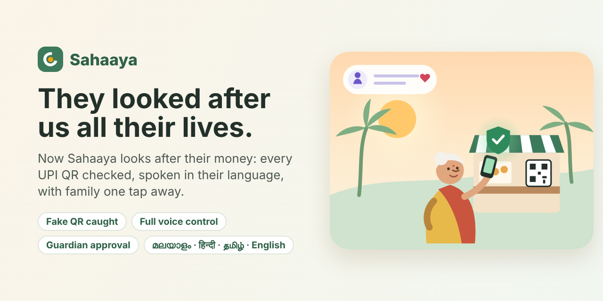

# Sahaaya



**Check who you are paying, before you pay.** An accessibility companion for UPI payments, in Malayalam, English, Hindi and Tamil, for people who can't read the payment screen: blind and low-vision users, elderly people, people with hand tremors or colour blindness, and first-time smartphone users.

## The problem

Since June 2025, UPI apps show the bank-verified name of the person being paid, just before the PIN. Reading that name is the main way people catch a fake QR sticker pasted over a shop's real one. In Khajuraho in January 2025, a fake-QR scam across more than a dozen shops was caught only because a customer read the wrong name on screen.

That check is visual. People who can't read the screen either pay blind or hand their phone to a stranger, which is exactly what QR-swap scams rely on.

## How it works in real life

**Once, with family (about 5 minutes).** A son, daughter or neighbour opens Sahaaya, which starts large and spoken. They pick the language, enter the user's name, tick what helps (hard to see, uses TalkBack, hands shake, hard to hear, new to smartphones…), choose the payment app, check the preview, set the app lock, add themselves as the trusted person with payment limits, and then **scan the QR of each regular shop once, at the shop**. Sahaaya remembers each shop's real account.

**Every day (4 steps).**
1. Open Sahaaya (fingerprint, face or code) and tap **Scan & pay safely**. For low-vision and TalkBack users the scanner opens straight away.
2. Scan the shop's QR. The phone vibrates faster as the code gets closer.
3. Hear the result, then say or type the amount.
4. **Final check:** one screen shows the amount, the shop and its account. The user taps "Yes, pay", says "yes", or says the amount again. If the amount said doesn't match ("2500" for a ₹250 payment), the payment is cancelled. Then Google Pay (or PhonePe, Paytm, BHIM) opens with everything filled in; the PIN is entered there.

| What the QR is | What Sahaaya says |
|---|---|
| A saved shop's account | ✓ "Lakshmi Bakery. Same account as always." |
| Claims a saved shop's name but pays another account | ✕ "Stop. Not Lakshmi Bakery's account. The sticker may have been replaced." Payment stays hidden until the user confirms they checked with the shop, then waits 10 seconds. |
| Any other account | ! "Not one of your shops. This QR pays Chhotu Tiwari. Not checked." |

Also caught: an extra zero compared with what this shop usually costs, an amount different from the one printed in the QR, "scan to receive money" tricks, and non-payment UPI requests.

The decision is always made on the **UPI ID**, never on the name written inside the QR, because anyone can type any name there. Sahaaya never says "safe".

## Built for different needs

| Need ticked at setup | What changes |
|---|---|
| Can't see the screen | **Full voice control:** Sahaaya speaks every screen and then listens. No buttons needed. Tap anywhere (or double-tap) to talk |
| Hard to see | Larger text, black-and-yellow contrast, everything spoken, vibration guides the camera, scanner opens on start, hands-free mode |
| Uses TalkBack | Sahaaya stays quiet and lets TalkBack read everything; hands-free mode on |
| Reading is hard | Easy-reading font, wider spacing, words highlighted as they are read aloud |
| Hard to tell colours apart | Blue / orange / magenta palette; meaning always shown with icons and words too |
| Hands shake | Big buttons, keypad that ignores double taps and brushes, hold-to-pay |
| Hard to hear | Flashing and vibrating warnings; no speech needed |
| New to smartphones | Simple screens, slower speech, a pointer on the next step |

**Full voice control (for blind users):** setup can be done entirely by voice ("Set up by voice": language, name, a family member's number). After that every screen is spoken and Sahaaya listens for what to do next: "pay", "report", "how much did I spend", "call my son", "read", "help", "back". A payment is: "pay" → scan (beeps rise in pitch as the QR comes into view, with spoken tips) → hear the result → say the amount → "right?" → final check → the UPI app opens. On a swapped QR it says "scan again, tell family, or continue".

**Understanding speech in four languages, offline:** amounts in digits of any script and in words, including Indian forms: "two fifty", "dhai sau", "साढ़े तीन सौ", "ഇരുന്നൂറ്റി അമ്പത്", "இருநூற்று ஐம்பது". Commands and yes/no match on word stems (Malayalam and Tamil word endings change), allow small English typos, include the English words people mix in ("scan", "report"), and are checked against all of the recogniser's guesses. Screen-specific words are tried before app-wide ones. Rising and falling beeps say when Sahaaya is listening, a short buzz confirms it understood, and what it heard is shown on screen.

**Pay a saved shop by name, no QR needed:** "Lakshmi Bakery 250" (or ലക്ഷ്മി ബേക്കറി 250, लक्ष्मी बेकरी 250, லட்சுமி பேக்கரி 250) goes straight to the check. Names are matched across scripts using a consonant skeleton, and the payment goes to the account saved for that shop. Also: "who am I paying", "what is my limit", and shake the phone to talk.

**Learns as you use it:** if taps keep missing buttons or repeating, Sahaaya offers bigger buttons. Voice commands work on every screen.

## Family and limits

**New shops need the guardian's OK.** At setup the trusted person picks a 4-digit Guardian PIN (only a salted hash is stored). When the user scans a QR that isn't one of their saved shops, payment is held:
1. "Ask Ravi to check" sends Ravi a WhatsApp link with the shop, account and amount.
2. The link opens Sahaaya on Ravi's phone (no setup needed there). He checks, or calls, enters his Guardian PIN and gets a 6-digit approval code to send back.
3. The user types or says the code. It only works for this request, this account and this amount, so it can't be reused, and the user never learns the PIN. The shop is then saved for next time.
If Ravi is sitting next to them, he can type his PIN on the user's phone instead. Payments over the limit use the same approval.


Limits: a trusted person (son, daughter, neighbour) is added at setup with their WhatsApp number, plus a per-payment and a daily limit. A payment over a limit is held until the user sends the prepared WhatsApp or SMS ("Ammini wants to pay ₹3,000 to Lakshmi Bakery. Is this OK?"). A swapped QR offers "Tell Raju about this QR". Messages go through the user's own WhatsApp/SMS, so no server is needed.

## Monthly report

The Report tab shows the month's total, the last six months as a bar chart, where the money went (shop by shop), and how many fake QR codes were stopped. "Send to Ravi" shares it on WhatsApp. At the start of a month, the home screen reminds the user to send last month's report.

## App lock

Sahaaya can be locked with the phone's own fingerprint or face (WebAuthn, needs HTTPS) or a 4-digit code stored only as a salted hash. This protects Sahaaya; the UPI PIN stays inside the UPI app, where banks that support it let users approve with fingerprint or face instead.

## Languages

Malayalam, English, Hindi and Tamil, for text and voice. Translations should be reviewed by native speakers.

## No bank or GPay integration needed

Sahaaya uses NPCI's standard UPI payment link (`upi://pay`), the same one every "Pay with any UPI app" button uses. On Android it can open a specific app directly. Money and PINs stay inside the user's UPI app; Sahaaya never sees them and never claims a payment succeeded.

Before relying on it, test on a real phone: Settings → "Test that your payment app opens" pays ₹1 to a UPI ID you choose. Some UPI apps limit link payments to personal accounts.

## Run it

No build step and no dependencies.

```bash
npm start                    # http://localhost:5173
python -m http.server 5173   # alternative without Node
npm test                     # 30 unit tests
npm run vendor               # optional: offline QR decoding for phones without BarcodeDetector
```

On a phone the camera needs HTTPS: deploy the folder to any static host (Netlify, Vercel, GitHub Pages) and open it in Chrome on Android.

**Trying it without a shop:** during setup, at "Add the shops you pay often", scan "Lakshmi Bakery (real)" from the Test QR codes panel to save it. Then from the home screen, try "Lakshmi Bakery (swapped sticker)". Printable codes: `/tools/print-qrs.html`.

## Project structure

```
index.html, styles.css   App shell and design system (profile applied via CSS variables)
src/app.js               Start-up, lock, voice commands, Android back button
src/onboarding.js        First-run setup (on screen or entirely by voice): name, needs, payment app, preview, lock, trusted person, shops
src/home.js              Lock screen, dashboard, history by month, shops, trusted people, profile, accessibility
src/pay.js               Scan → Check → Amount → Final check → Pay, voice payments, family limits; add a shop
src/report.js            Monthly totals, per-shop breakdown, six-month trend
src/report-screen.js     Report screen and WhatsApp sharing
src/guardian.js          Guardian PIN, approval codes tied to account and amount, request links
src/approve.js           The guardian's approval page (opens from the WhatsApp link)
src/spoken.js            Amounts, yes/no and phrase matching in Malayalam, English, Hindi, Tamil
src/commands.js          Voice commands in four languages
src/auth.js              Fingerprint/face (WebAuthn) and 4-digit code lock
src/family.js            Trusted people, WhatsApp/SMS alerts, payment limits
src/lang/                English, Malayalam, Hindi, Tamil
src/icons.js             Line icons
src/safety.js            Payment check (account comparison, swap detection, amount rules)
src/profile.js           Needs → settings; applies them to the page
src/adapt.js             Offers bigger buttons after missed or repeated taps
src/upi.js               UPI QR parsing, standard and app-specific payment links
src/scanner.js           Camera QR scanning with vibration guidance
src/speech.js            Speech out/in, word highlighting, vibration
src/keypad.js            Tremor-tolerant keypad
src/match.js, amount.js, i18n.js, store.js, ui.js, demo-codes.js, adapt.js
tests/                   Node test runner
```

## Privacy

No backend and no account. Profile, settings, trusted people, saved shops and history stay on the phone.

## License

MIT
